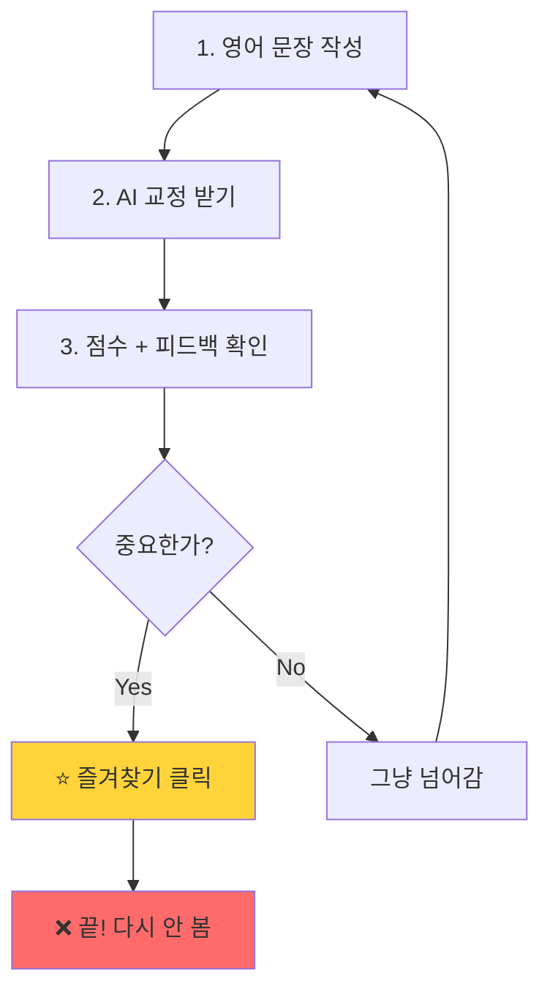
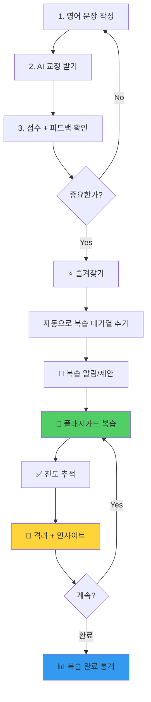

# 🗺️ WriteBuddy 기능 진단 & 로드맵

> 분석 날짜: 2026-01-06
> 분석 목적: 복습 기능 약점 분석 및 전체 기능 갭 시각화

---

## 📊 현재 상태 진단

### ✅ 구현된 핵심 기능

```
┌─────────────────────────────────────────────┐
│           WriteBuddy 현재 시스템             │
├─────────────────────────────────────────────┤
│                                             │
│  1️⃣ 교정 시스템 (Correction)                │
│     ✓ AI 기반 문법 교정                      │
│     ✓ 품질 점수 (1-10점)                    │
│     ✓ 피드백 제공 (문법/스타일 등)            │
│     ✓ 즐겨찾기 기능 ⭐                       │
│     ✓ 교정 내역 저장                         │
│     ✓ 학습 인사이트 (통계 카드)               │
│                                             │
│  2️⃣ 연습 시스템 (Practice)                  │
│     ✓ AI 생성 랜덤 문장                      │
│     ✓ 한→영 번역 연습                        │
│     ✓ 힌트 제공                             │
│     ✓ Best Answer 확인                      │
│                                             │
│  3️⃣ AI 채팅 도우미                          │
│     ✓ 영어 학습 상담                         │
│                                             │
│  4️⃣ 단어 학습 (Word)                        │
│     ✓ wordService 존재                      │
│                                             │
└─────────────────────────────────────────────┘
```

### ❌ 주요 기능 갭

```
🚨 복습 시스템의 치명적 약점
━━━━━━━━━━━━━━━━━━━━━━━━━━━━━━━━━━━━

문제 1: 즐겨찾기 ⭐ 만 있고 복습 방법이 없음
  ├─ 즐겨찾기 클릭 → 그냥 표시만 됨
  ├─ 복습 버튼/기능 없음
  ├─ 즐겨찾기한 항목 다시 보는 방법 없음
  └─ 결과: "즐겨찾기만 하고 다시 안 봄" 💀

문제 2: PracticePanel과 CorrectionHistory 단절
  ├─ PracticePanel: 랜덤 AI 문장만 연습
  ├─ CorrectionHistory: 내 틀린 문장 저장
  ├─ 두 시스템이 연결 안 됨!
  └─ 결과: "내 약점 복습 못함" 💀

문제 3: 진도/성장 추적 없음
  ├─ 복습 횟수 추적 없음
  ├─ 복습 스케줄 없음
  ├─ 완료율/달성률 없음
  └─ 결과: "얼마나 복습했는지 모름" 💀

문제 4: 동기부여 시스템 약함
  ├─ 인사이트 카드만 있음 (교정 횟수, 평균 점수)
  ├─ 복습 완료 시 보상 없음
  ├─ 격려 메시지 부족
  └─ 결과: "복습하고 싶은 마음 안 듦" 💀
```

---

## 🧠 사용자 여정 분석 (현재 vs 이상적)

### 현재 여정 (문제 많음)



**문제점:**
- 즐겨찾기 후 **복습 동선이 끊김**
- 사용자가 능동적으로 과거 내역 찾아가야 함
- 복습 유도 시스템 전무

### 이상적인 여정 (복습 중심)



**개선점:**
- 즐겨찾기 → 자동 복습 대기열
- 능동적 복습 제안 (알림/버튼)
- 플래시카드 형식
- 진도 추적 + 완료 보상

---

## 🎯 기능 우선순위 매트릭스

```
        학습 효과 높음
             ↑
             │
   ┌─────────┼─────────┐
   │  📅 계획 │ 🔥 지금! │
   │         │         │
   │ · 틀린  │ · 플래시│
   │   패턴  │   카드  │
   │   분석  │   복습  │
   │         │         │
   │ · 간격  │ · 복습  │
   │   반복  │   버튼  │
   │   알고  │   추가  │
   │   리즘  │         │
 ─ ├─────────┼─────────┤ ─
개 │ 🤔 여유 │ 🗑️ 안함 │ 개
발 │         │         │ 발
공 │ · 학습  │ · 음성  │ 공
수 │   뱃지  │   인식  │ 수
낮 │         │   교정  │ 높
음 │ · 친구  │         │ 음
   │   비교  │ · 고급  │
   │         │   AI    │
   │         │   분석  │
   └─────────┼─────────┘
             │
             ↓
        학습 효과 낮음
```

### 🔥 지금 당장 (This Week)
1. **플래시카드 복습** - 즐겨찾기 기반
2. **복습 버튼 추가** - CorrectionHistory에 "랜덤 복습" 버튼

### 📅 다음 스프린트 (Next 2 Weeks)
3. **복습 진도 추적** - localStorage 기반 간단한 완료율
4. **틀린 패턴 분석** - 자주 틀린 문법 카테고리 TOP 3

### 🤔 여유 있을 때 (Backlog)
5. **학습 뱃지 시스템** - 동기부여
6. **간격 반복 알고리즘** - Spaced Repetition

### 🗑️ 하지 않기
- 음성 인식 교정 (복잡도 너무 높음)
- 고급 AI 분석 (현재 OpenAI로 충분)

---

## 🗺️ 4주 로드맵 (Phase별)

```
┌─────────────────────────────────────────────────────────────────┐
│                      WriteBuddy 복습 시스템 로드맵                │
└─────────────────────────────────────────────────────────────────┘

Week 1: 🥉 Bronze - 복습 핵심 기능 (최소 동작)
━━━━━━━━━━━━━━━━━━━━━━━━━━━━━━━━━━━━━━━━━━━━━
  🎯 목표: 즐겨찾기를 다시 볼 수 있게!

  ✅ Task 1.1: CorrectionHistory에 "랜덤 복습" 버튼 추가
     - 위치: 학습 인사이트 카드 옆
     - 동작: 즐겨찾기 중 랜덤 1개 모달 표시
     - 시간: 0.5일

  ✅ Task 1.2: 복습 모달 컴포넌트 생성
     - 원문 가리기 → 클릭하면 교정문 보기
     - "다음 문장" 버튼
     - 시간: 0.5일

  📊 성공 지표:
     - 복습 버튼 클릭률 측정 (localStorage)
     - 목표: 즐겨찾기 사용자의 30% 이상 복습 버튼 클릭

  ⏱️ 총 소요: 1일


Week 2: 🥈 Silver - 복습 UX 개선 (자동화)
━━━━━━━━━━━━━━━━━━━━━━━━━━━━━━━━━━━━━━━━━━━━━
  🎯 목표: 복습이 재미있게!

  ✅ Task 2.1: 플래시카드 UI 구현
     - PracticePanel 스타일 재사용
     - 앞면(원문) / 뒷면(교정문) 플립 애니메이션
     - 진도 표시 (3/10)
     - 시간: 1일

  ✅ Task 2.2: 복습 진도 추적 (localStorage)
     - 오늘 복습한 항목 추적
     - 복습 완료율 표시
     - 시간: 0.5일

  ✅ Task 2.3: 복습 완료 격려 메시지
     - Toss 스타일 친근한 메시지
     - "🎉 오늘 5개 복습 완료! 내일도 화이팅!"
     - 시간: 0.5일

  📊 성공 지표:
     - 1회 세션당 평균 복습 개수
     - 목표: 평균 3개 이상
     - 복습 완료율
     - 목표: 시작한 세션의 70% 이상 완료

  ⏱️ 총 소요: 2일


Week 3: 🥇 Gold - 학습 인사이트 (데이터 활용)
━━━━━━━━━━━━━━━━━━━━━━━━━━━━━━━━━━━━━━━━━━━━━
  🎯 목표: 학습 패턴 가시화!

  ✅ Task 3.1: 복습 통계 대시보드
     - 주간 복습 횟수 차트
     - 즐겨찾기 vs 복습 완료 비율
     - 시간: 1일

  ✅ Task 3.2: 틀린 패턴 분석 (Basic)
     - feedbackType 기반 집계
     - 자주 틀린 카테고리 TOP 3
     - "문법(GRAMMAR) 실수가 많아요!" 메시지
     - 시간: 1일

  ✅ Task 3.3: 약점 집중 연습 제안
     - "문법 실수가 많네요. 관련 문제 연습할까요?" 버튼
     - PracticePanel과 연동 (추후 확장)
     - 시간: 1일

  📊 성공 지표:
     - 통계 대시보드 열람률
     - 목표: 주 1회 이상 확인
     - 약점 연습 클릭률
     - 목표: 20% 이상

  ⏱️ 총 소요: 3일


Week 4: 🚀 Launch & 피드백 (검증 & 개선)
━━━━━━━━━━━━━━━━━━━━━━━━━━━━━━━━━━━━━━━━━━━━━
  🎯 목표: 사용자 반응 수집 & 빠른 개선

  ✅ Task 4.1: 실제 사용자 테스트
     - 주변 영어 학습자 5명 테스트
     - 복습 기능 사용성 인터뷰
     - 시간: 2일

  ✅ Task 4.2: 피드백 반영 & 버그 수정
     - 치명적 버그 수정
     - 사용성 개선 (버튼 위치, 메시지 문구 등)
     - 시간: 2일

  ✅ Task 4.3: 성공 지표 분석
     - 복습률: 즐겨찾기한 항목 재방문 비율
     - 재방문율: 7일 내 재방문 사용자 비율
     - 평균 품질 점수 향상도

  📊 최종 목표:
     - 복습률: 0% → 30% 달성
     - 재방문율: 현재 대비 +20%p
     - 평균 점수: +0.5점 향상

  ⏱️ 총 소요: 4일


🎉 4주 후 예상 결과
━━━━━━━━━━━━━━━━━━━━━━━━━━━━━━━━━━━━━━━━━━━━━
  ✓ 즐겨찾기가 진짜 유용한 기능으로 변신!
  ✓ 사용자가 매일 복습하러 돌아옴
  ✓ 학습 효과 가시화 → 동기부여 상승
  ✓ 약점 파악 → 맞춤 연습 가능
```

---

## 🌲 기능 마인드맵

```
                        WriteBuddy
                            │
         ┌──────────────────┼──────────────────┐
         │                  │                  │
    📝 교정 시스템       💬 AI 도우미      📊 학습 관리
         │                                     │
    ┌────┴────┐                    ┌──────────┼──────────┐
    │         │                    │          │          │
  교정 기능  내역 관리            복습 시스템  통계 시스템  진도 관리
    │         │                    │          │          │
    ├─ AI 교정 ├─ 저장           ┌─┴─┐    ┌──┴──┐       │
    ├─ 점수    ├─ 검색        플래시카드 틀린패턴   ├─ 완료율
    ├─ 피드백  └─ 즐겨찾기 ⭐    │      분석        ├─ 목표설정
    └─ 예문       │           ├─ 앞/뒤    │         └─ 보상
                  │           ├─ 진도    ├─ TOP3
                  │           └─ 격려    ├─ 약점
                  │                     └─ 제안
                  │
           ❌ 복습 방법 없음!
              (현재 GAP)


🔥 우선 개선 영역 (빨간색 박스)
━━━━━━━━━━━━━━━━━━━━━━━━━━━━━━

┌────────────────────────────────┐
│  즐겨찾기 ⭐                    │
│      ↓                         │
│  ❌ 복습 시스템 없음            │
│      ↓                         │
│  💀 사용자 이탈                 │
└────────────────────────────────┘

해결책:
  1. 즐겨찾기 → 플래시카드 복습
  2. 복습 진도 추적
  3. 격려 + 인사이트
```

---

## 📋 기술 구현 상세 (Phase 1 - Week 1)

### 🥉 Bronze: 복습 버튼 + 모달 (1일 완성)

#### 변경 파일 목록
```
src/
├── components/
│   ├── CorrectionHistory/
│   │   ├── CorrectionHistory.tsx      ← 수정 (복습 버튼 추가)
│   │   └── CorrectionHistory.css      ← 수정 (버튼 스타일)
│   └── ReviewModal/                    ← 신규 생성
│       ├── ReviewModal.tsx
│       └── ReviewModal.css
└── hooks/
    └── useReviewStats.ts               ← 신규 (localStorage 관리)
```

#### Task 1.1: CorrectionHistory에 복습 버튼 추가

**위치**: 학습 인사이트 카드 영역
```tsx
// CorrectionHistory.tsx 수정 (line 121 근처)

<div className="learning-insights">
  <div className="insight-cards">
    {/* 기존 카드들 */}
    <div className="insight-card">...</div>

    {/* 🔥 신규: 복습 버튼 카드 */}
    <div className="insight-card review-card" onClick={handleStartReview}>
      <div className="insight-number">🔄</div>
      <div className="insight-label">랜덤 복습</div>
    </div>
  </div>
</div>
```

**구현 로직**:
```typescript
const [showReviewModal, setShowReviewModal] = useState(false);
const [currentReviewItem, setCurrentReviewItem] = useState<Correction | null>(null);

const handleStartReview = () => {
  // 즐겨찾기 항목만 필터링
  const favorites = corrections.filter(c => c.isFavorite);

  if (favorites.length === 0) {
    // 즐겨찾기 없으면 토스트
    showToast('즐겨찾기한 문장이 없어요!');
    return;
  }

  // 랜덤 선택
  const randomIndex = Math.floor(Math.random() * favorites.length);
  setCurrentReviewItem(favorites[randomIndex]);
  setShowReviewModal(true);
};
```

#### Task 1.2: ReviewModal 컴포넌트 생성

**인터페이스**:
```typescript
interface ReviewModalProps {
  correction: Correction;
  onClose: () => void;
  onNext: () => void;
}
```

**UI 구조**:
```tsx
<div className="review-modal-overlay">
  <div className="review-modal">
    {/* 헤더 */}
    <div className="review-header">
      <span>💪 복습 중</span>
      <button onClick={onClose}>✕</button>
    </div>

    {/* 원문 (가려져 있음) */}
    <div className="review-sentence original">
      {showAnswer ? correction.originSentence : '▒▒▒▒▒▒▒▒▒'}
    </div>

    {/* 교정문 */}
    <div className="review-sentence corrected">
      {correction.correctedSentence}
    </div>

    {/* 피드백 */}
    <div className="review-feedback">
      💡 {correction.feedback}
    </div>

    {/* 액션 버튼 */}
    <div className="review-actions">
      {!showAnswer && (
        <button onClick={() => setShowAnswer(true)}>
          👀 원문 보기
        </button>
      )}
      <button onClick={onNext}>
        ➡️ 다음 문장
      </button>
    </div>
  </div>
</div>
```

#### 검증 체크리스트
```
✅ 즐겨찾기 항목이 없을 때 적절한 메시지 표시
✅ 모달 외부 클릭 시 닫힘
✅ ESC 키로 닫힘
✅ "다음 문장" 클릭 시 새로운 랜덤 항목 로드
✅ 모바일 반응형 (화면 작을 때도 잘 보임)
```

---

## 💡 예상 효과

### 정량적 지표

| 지표 | 현재 | 1주 후 | 4주 후 | 측정 방법 |
|------|------|--------|--------|-----------|
| 복습률 | 0% | 15% | 30% | 즐겨찾기 재방문 / 전체 즐겨찾기 |
| 1회 세션 복습 개수 | 0개 | 2개 | 5개 | localStorage 기록 |
| 재방문율 (7일) | ? | +10%p | +20%p | 사용자 로그 |
| 평균 품질 점수 | ? | +0.2 | +0.5 | 시간대별 평균 점수 비교 |

### 정성적 효과

**사용자 입장:**
- ✅ "즐겨찾기가 진짜 유용해졌어요!"
- ✅ "틀린 부분을 계속 보니까 실력이 느는 게 느껴져요"
- ✅ "복습 완료하니까 뿌듯해요!"

**비즈니스 입장:**
- ✅ 재방문율 증가 → MAU 상승
- ✅ 학습 효과 증가 → 입소문 증가
- ✅ 데이터 축적 → AI 개선 가능

---

## 🚧 리스크 & 대응

| 리스크 | 발생 가능성 | 영향도 | 대응 방안 |
|--------|------------|--------|-----------|
| 복습 기능을 안 쓸 수 있음 | 중 | 고 | 1) 온보딩 팝업 추가<br>2) 복습 버튼 위치 최적화<br>3) 첫 복습 시 격려 메시지 |
| 즐겨찾기 개수가 적음 | 중 | 중 | 1) 즐겨찾기 유도 문구<br>2) 추천 즐겨찾기 제안 |
| 모바일 UX가 불편할 수 있음 | 중 | 중 | 1) 반응형 우선 설계<br>2) 모바일 실제 테스트 |
| localStorage 용량 제한 | 저 | 저 | 1) 최근 30일만 저장<br>2) 추후 서버 저장 고려 |

---

## 🎓 학습 포인트 (팀 공유용)

### 이번 프로젝트에서 배울 것

1. **애자일 사고방식**
   - Bronze → Silver → Gold 점진적 개선
   - 빠른 피드백 루프

2. **학습 과학 적용**
   - Spaced Repetition (간격 반복)
   - Active Recall (능동 회상)
   - Feedback Loop (즉각적 피드백)

3. **사용자 중심 설계**
   - 즐겨찾기라는 기존 행동에 복습 연결
   - 마찰 최소화 (클릭 1번으로 복습 시작)

4. **데이터 기반 의사결정**
   - 명확한 지표 설정
   - 주간 단위 검증

---

## 📝 다음 스텝 (실행 계획)

### 🔥 지금 바로 시작 (Priority 1)

```bash
# 1. 브랜치 생성
git checkout -b feature/flashcard-review-bronze

# 2. ReviewModal 컴포넌트 생성
mkdir -p src/components/ReviewModal
touch src/components/ReviewModal/ReviewModal.tsx
touch src/components/ReviewModal/ReviewModal.css

# 3. CorrectionHistory 수정
# - 복습 버튼 추가
# - 모달 연동

# 4. 로컬 테스트
npm run dev

# 5. 즐겨찾기 여러 개 추가해서 테스트
# 6. 복습 버튼 클릭 → 랜덤 문장 확인
# 7. "다음 문장" → 다른 랜덤 문장 확인
```

### 💬 논의 필요 (Questions)

1. **복습 모달 디자인**: 현재 PracticePanel 스타일 재사용 vs 새로운 디자인?
   - 추천: PracticePanel 스타일 재사용 (일관성 + 빠른 개발)

2. **복습 버튼 위치**: 인사이트 카드 vs 별도 버튼 vs 즐겨찾기 옆?
   - 추천: 인사이트 카드 (시각적으로 눈에 잘 띔)

3. **첫 복습 온보딩**: 팝업 vs 툴팁 vs 없음?
   - 추천: 첫 복습 시 격려 토스트 메시지만

4. **진도 저장**: localStorage vs 서버?
   - 추천: Week 1-2는 localStorage, Week 3부터 서버 고려

---

## 🎯 성공 정의 (Definition of Done)

### Week 1 완료 기준
- [ ] 복습 버튼이 CorrectionHistory에 표시됨
- [ ] 버튼 클릭 시 즐겨찾기 중 랜덤 1개 모달 표시
- [ ] 모달에서 원문 가리기/보기 동작
- [ ] "다음 문장" 버튼으로 다른 랜덤 항목 로드
- [ ] 즐겨찾기 0개일 때 적절한 메시지
- [ ] 모바일에서도 정상 동작
- [ ] 실제 사용자 1명 이상 테스트 완료

### Week 2-3 완료 기준
- [ ] 플래시카드 UI (앞/뒤 플립)
- [ ] 진도 표시 (3/10)
- [ ] 복습 완료 시 격려 메시지
- [ ] 복습 통계 대시보드
- [ ] 틀린 패턴 TOP 3 표시

### Week 4 완료 기준
- [ ] 복습률 30% 달성
- [ ] 재방문율 +20%p 달성
- [ ] 사용자 피드백 5명 이상 수집
- [ ] 치명적 버그 0개

---

## 📚 참고 자료

### 비슷한 기능 구현 사례
- Duolingo: 틀린 문제 재출제 시스템
- Anki: 간격 반복 플래시카드
- Quizlet: 학습 모드 다양성

### 학습 과학 논문
- [Spaced Repetition for Efficient Learning](https://en.wikipedia.org/wiki/Spaced_repetition)
- [Testing Effect (Active Recall)](https://en.wikipedia.org/wiki/Testing_effect)

### 디자인 참고
- Toss: 친근한 메시지, 격려 문구
- Duolingo: 학습 완료 애니메이션
- Notion: 깔끔한 모달 UI

---

## 🤝 팀 논의 노트

*이 섹션은 팀 회의 후 작성*

**논의 일자:**
**참석자:**
**결정 사항:**
**추가 아이디어:**

---

## 📊 변경 이력

| 날짜 | 버전 | 변경 내용 | 작성자 |
|------|------|-----------|--------|
| 2026-01-06 | 1.0 | 초안 작성 - 복습 기능 진단 & 4주 로드맵 | PM Agent |

---

## 🎨 Appendix: UI 목업 (간단 스케치)

### 복습 버튼 (CorrectionHistory)

```
┌─────────────────────────────────────────────┐
│          📊 학습 인사이트                    │
├─────────────────────────────────────────────┤
│  ┌────────┐  ┌────────┐  ┌────────┐  ┌────────┐
│  │   15   │  │  7.2   │  │   8    │  │   🔄   │
│  │ 교정완료│  │평균점수 │  │완벽문장 │  │랜덤복습 │ ← 🔥 신규!
│  └────────┘  └────────┘  └────────┘  └────────┘
└─────────────────────────────────────────────┘
```

### 복습 모달

```
┌───────────────────────────────────────────────┐
│  💪 복습 중                               ✕   │
├───────────────────────────────────────────────┤
│                                               │
│  [원문 - 가려짐]                              │
│  ▒▒▒▒▒▒▒▒▒▒▒▒▒▒▒▒▒▒▒▒                        │
│                                               │
│  [교정문]                                     │
│  I have been studying English for 3 years.   │
│                                               │
│  💡 현재완료 시제를 사용하여 계속된 상태를     │
│     나타내는 것이 더 자연스러워요.             │
│                                               │
│  ┌──────────────┐  ┌──────────────┐         │
│  │ 👀 원문 보기  │  │ ➡️ 다음 문장 │         │
│  └──────────────┘  └──────────────┘         │
│                                               │
└───────────────────────────────────────────────┘
```

---

> 💬 **PM 한마디**
> "복습은 학습의 핵심이에요! 즐겨찾기 데이터가 이미 있으니 1일 만에 Bronze 버전 만들 수 있어요. 일단 빠르게 만들어서 사용자 반응 보는 게 최고입니다! 🚀"
